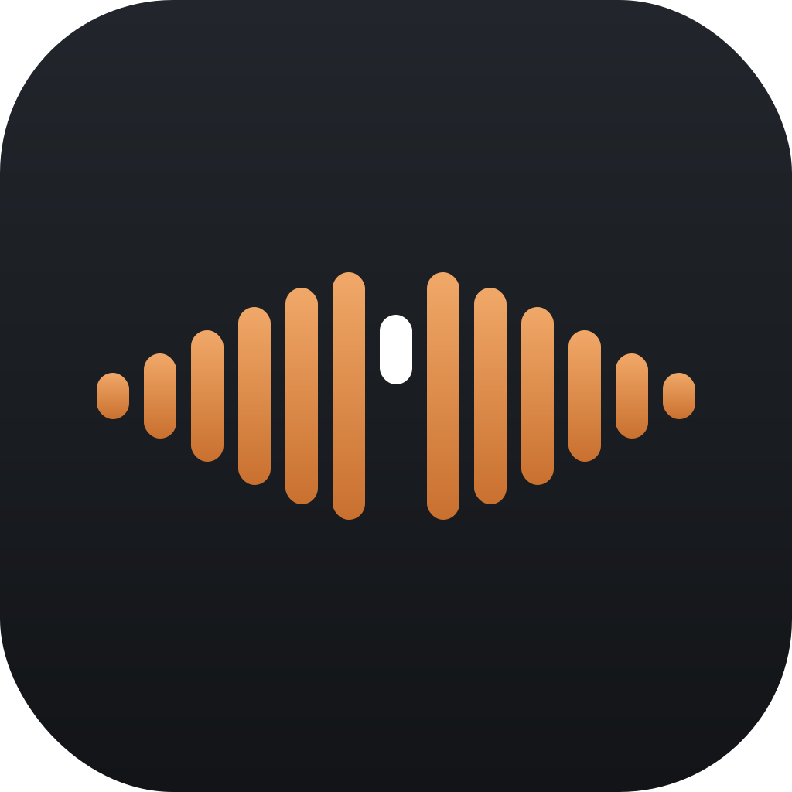
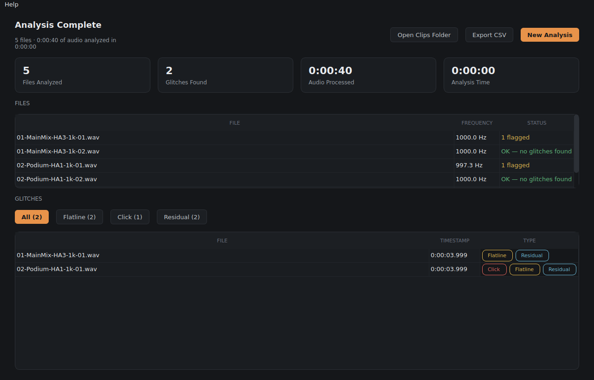

# Glitchy



Detects glitches (clicks/pops, flatlines, distortion/residual energy, and
frequency deviation) in recorded or live test-tone audio. Built for
verifying broadcast/audio signal chains end to end.

**[kevintayloruk.github.io/Glitchy](https://kevintayloruk.github.io/Glitchy/)** ·
[Download the latest release](https://github.com/kevintayloruk/Glitchy/releases/latest) ·
MIT licensed

<br clear="left">

## Features

- **Recorded mode**: point it at a file or folder of WAV files, analyzes
  them in parallel (one process per file, up to your core count), auto- or
  manually-set tone frequency, exports flagged clips with independently
  configurable pre-roll/post-issue timing, CSV export.
- **Live Monitor mode**: same detection engine running continuously against
  a sound card input or a network audio stream (via an SDP file, browsed or
  pasted -- works with AES67/Dante-style multicast streams). Runs until
  stopped, or for a set duration. Alerts and clips as it goes.
- **About page**: a plain-language reference for what each glitch type
  means, with a waveform diagram for each.



## Running from source (for development/testing)

```
python3 -m venv venv
source venv/bin/activate        # on Windows: venv\Scripts\activate.bat
pip install -r requirements.txt
python3 glitchy_gui.py
```

Live Monitor's Network Stream mode needs `ffmpeg` on your PATH (it does the
actual RTP receive/decode). Sound Card mode needs PortAudio, which
`sounddevice`'s wheel usually bundles -- if it complains, `brew install
portaudio` (Mac) or install PortAudio for your platform.

## Building the Mac app

```
chmod +x build_mac.sh
./build_mac.sh
```

This installs `ffmpeg`/`portaudio`/`create-dmg` via Homebrew if missing,
builds a clean virtual environment, runs PyInstaller, and packages the
result as `Glitchy.dmg` with a custom install window (drag-to-Applications,
matching Glitchy's colors). **Run this on a Mac** -- app bundles can't be
built from another OS.

### First launch

Glitchy isn't signed with a paid Apple Developer certificate (that costs
$99/year, and isn't worth it for an internal tool). macOS will say it's
"from an unidentified developer" the first time anyone opens it. To get
past that:

1. **Right-click** (not double-click) `Glitchy.app` in Applications
2. Choose **Open**
3. Click **Open** again on the warning dialog

This is only needed once per Mac -- after that it opens normally. If you
send the DMG to someone else, give them this same heads-up.

## Building the Windows exe

```
build_windows.bat
```

Same idea, run on Windows. You'll separately need `ffmpeg` on your PATH for
Network Stream mode (grab it from ffmpeg.org -- there's no Homebrew
equivalent baked into the script for Windows).

## What's been tested, and what hasn't

Originally built and validated in a Linux sandbox with no audio hardware and
no display, then hardened further through real use on macOS (several real
bugs -- a Cancel button that didn't actually kill worker processes, a DMG
background scaling mismatch, a Finder label-color issue, a couple of QSS
styling cascade bugs -- were found and fixed this way).

**Confirmed working, including on real hardware:**
- Chunked file detection (all four glitch types), including chunk-boundary
  handling
- Auto-frequency detection (accurate to within 0.01 Hz against a
  deliberately non-round test tone)
- Multiprocessing batch analysis on a real Mac -- files processed in
  parallel across all cores, progress bars, Results page, CSV export
- Cancel button reliably terminates every in-progress worker process
  (verified against the OS process list directly, not just app-level state)
- Clip extraction with independent pre-roll/post-issue durations
- The packaged macOS `.app`/DMG build, including the custom install window
- Graceful handling of the laptop-sleep-during-a-long-batch case

**Written carefully but not yet confirmed against real hardware:**
- `SoundCardSource` (sounddevice/PortAudio input) for Live Monitor -- the
  API usage follows sounddevice's documented callback pattern and the
  underlying rolling-buffer detector is tested with a synthetic signal, but
  hasn't yet captured real audio from a physical device
- The Network Stream (SDP) path was validated with ffmpeg as a fake AES67
  sender over multicast loopback (confirmed correct end to end), but not
  yet against a real console/router's multicast stream
- The full Live Monitor GUI flow end-to-end against a live device or feed

If something in the untested list misbehaves, the most likely spots are
`glitchy_capture.py` (`SoundCardSource`, `NetworkSource`) and the Live
Monitor wiring in `glitchy_gui.py` (`start_live_monitor`, `_poll_live`).

## Files

- `glitchy_core.py` -- detection engine (shared by batch and live)
- `glitchy_capture.py` -- live audio sourcing (sound card / network) and
  the rolling-buffer live detector
- `glitchy_gui.py` -- the app itself
- `resources/` -- icons and third-party license notices
- `build_mac.sh` / `build_windows.bat` -- packaging scripts
- `docs/` -- the GitHub Pages site (kevintayloruk.github.io/Glitchy)
- `LICENSE` -- MIT
